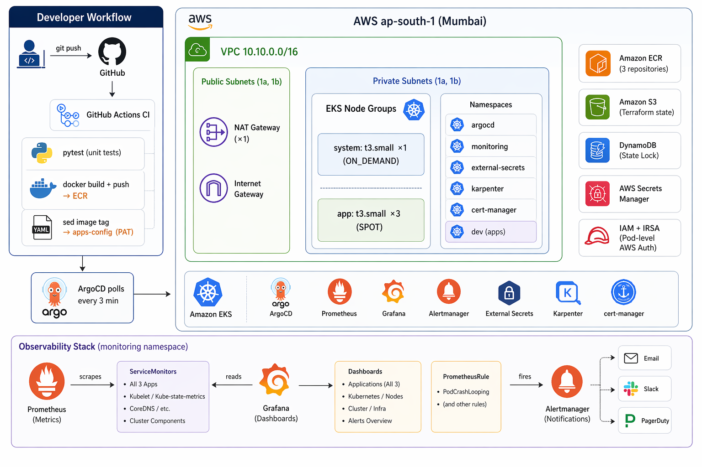
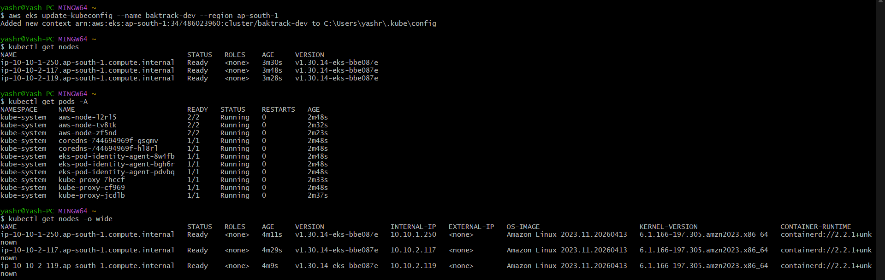
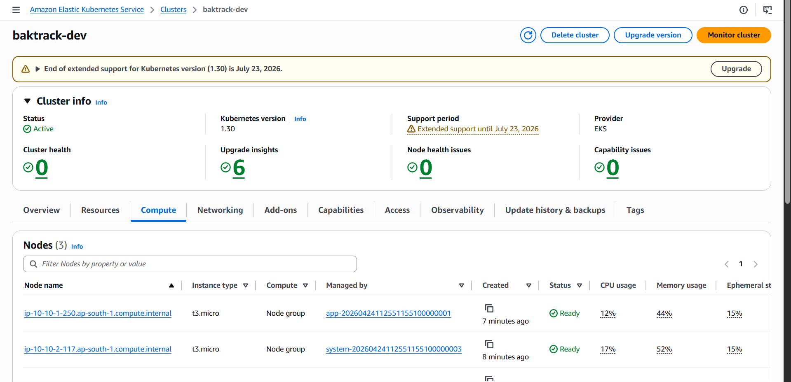
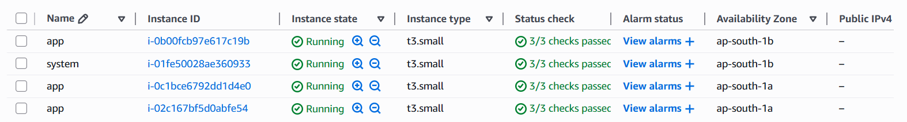
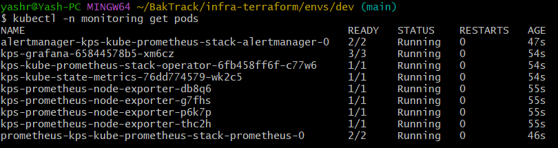
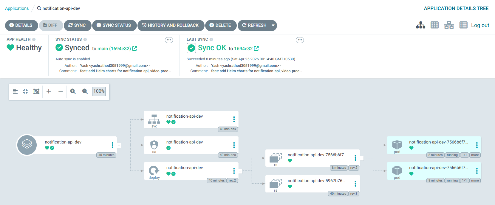
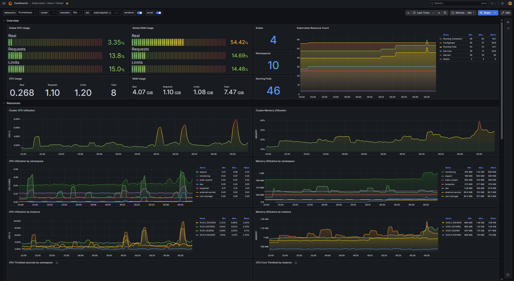
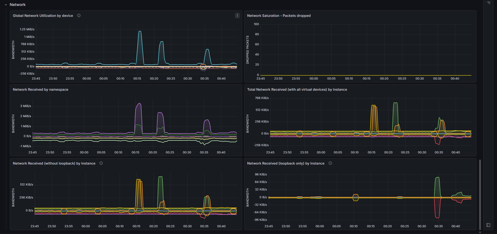
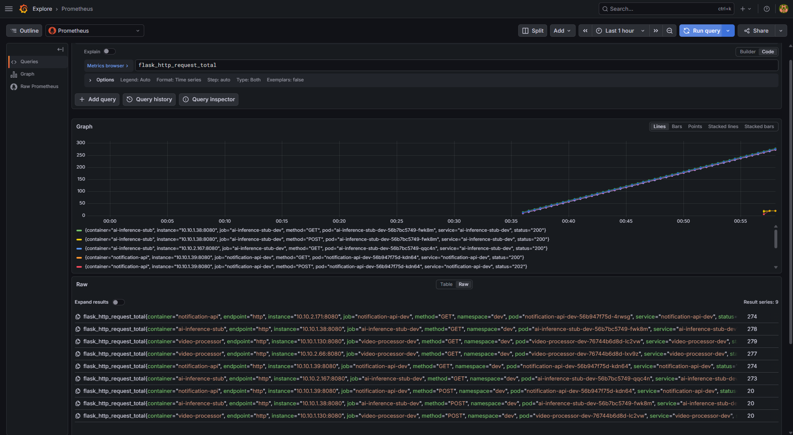
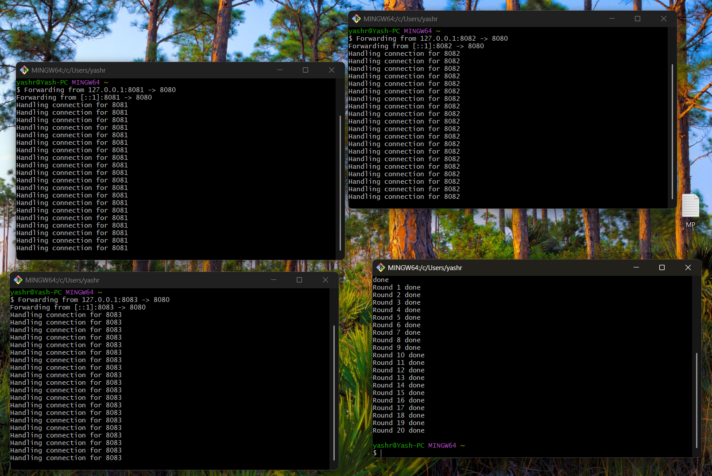

# BakTrack EKS Reference Architecture

> Production-grade DevOps platform on AWS EKS — Terraform-provisioned infrastructure, GitHub Actions CI, ArgoCD GitOps, and self-hosted observability, inspired by a real video-surveillance SaaS.


---

## What is this?

This is an open-sourced reference architecture inspired by my work at **BakTrack**, a video-surveillance-over-CCTV SaaS. It simulates the cloud platform that would host BakTrack's core services — a notification API, a video-processing worker, and an AI inference service — on a production-grade Kubernetes stack.

The goal is not a toy. Every component reflects real engineering decisions: IRSA instead of static credentials, GitOps instead of imperative deploys, spot instances with on-demand system nodes, a single NAT Gateway to cut costs without sacrificing function, and Karpenter for node autoscaling. The three mock microservices prove the pipeline end-to-end without requiring real video feeds.

**Three public repos, one coherent system:**

| Repo | Role |
|---|---|
| [`infra-terraform`](https://github.com/Yash-Rathod/infra-terraform) | AWS infra — VPC, EKS, ECR, IAM, state backend |
| [`helm-charts`](https://github.com/Yash-Rathod/helm-charts) | Helm charts for the three mock BakTrack services |
| [`apps-config`](https://github.com/Yash-Rathod/apps-config) | ArgoCD Application manifests — the GitOps source of truth |

---

## Architecture



---

## Tech Stack

| Layer | Technology | Why |
|---|---|---|
| Cloud | AWS (ap-south-1) | Mumbai region — low latency for India-based surveillance |
| Kubernetes | EKS 1.30 | Managed control plane, no etcd ops |
| Infrastructure as Code | Terraform 1.8 + official AWS modules | Reproducible, versioned infra |
| State backend | S3 + DynamoDB | Remote state with locking — standard prod pattern |
| Networking | Custom VPC, 2 AZs, single NAT | HA layout at minimum cost (~$32/mo saved vs dual NAT) |
| Container registry | ECR | Native IAM auth, no credentials in CI |
| CI | GitHub Actions + OIDC | No long-lived AWS keys — OIDC role assumption |
| CD / GitOps | ArgoCD 3.3.8 (app-of-apps) | Declarative, auditable, self-healing |
| Node autoscaling | Karpenter | Faster and cheaper than cluster-autoscaler |
| Secrets | External Secrets Operator → Secrets Manager | Secrets never in git, auto-rotatable |
| TLS | cert-manager | Certificate lifecycle managed in-cluster |
| Ingress | AWS Load Balancer Controller | ALB provisioned via Kubernetes Ingress |
| Observability | kube-prometheus-stack | Prometheus + Grafana + Alertmanager, pre-wired |
| App metrics | prometheus_flask_exporter | Per-endpoint request rate and latency |
| IAM auth | IRSA (IAM Roles for Service Accounts) | Pod-level AWS auth, no node-level over-permission |
| Mock services | Python 3.12 / Flask | Lightweight, proves the pipeline without real workloads |

---

## Repo Layout

```
infra-terraform/                   ← this repo
├── bootstrap/                     # One-time: S3 + DynamoDB for TF state
│   ├── main.tf
│   ├── variables.tf
│   └── outputs.tf
├── modules/
│   ├── vpc/                       # VPC + subnets + NAT
│   ├── eks/                       # EKS cluster + node groups + IRSA
│   ├── ecr/                       # ECR repos with lifecycle policy
│   └── iam-irsa/                  # Reusable IRSA role module
├── envs/
│   ├── dev/                       # Applied — the live cluster
│   │   ├── main.tf
│   │   ├── backend.tf
│   │   ├── variables.tf
│   │   ├── terraform.tfvars
│   │   ├── outputs.tf
│   │   ├── alb_controller_irsa.tf
│   │   ├── karpenter_irsa.tf
│   │   └── github_oidc.tf
│   ├── staging/                   # Code-only, not applied (cost saving)
│   └── prod/                      # Code-only, not applied (cost saving)
└── docs/
    └── architecture.md

helm-charts/                       ← separate repo
└── charts/
    ├── notification-api/
    ├── video-processor/
    └── ai-inference-stub/

apps-config/                       ← separate repo (GitOps source of truth)
├── bootstrap/
│   └── root-app.yaml              # ArgoCD app-of-apps entry point
└── envs/
    ├── dev/
    │   ├── notification-api.yaml
    │   ├── video-processor.yaml
    │   ├── ai-inference-stub.yaml
    │   └── alerts.yaml
    ├── staging/
    └── prod/

mock-services/                     ← separate repo
├── notification-api/
├── video-processor/
└── ai-inference-stub/
```

---

## Mock Services

| Service | Endpoint | Simulates |
|---|---|---|
| `notification-api` | `POST /notify` → 202 | Push/email alert dispatch |
| `video-processor` | `POST /process` → `gif_url` | Frame stitching worker |
| `ai-inference-stub` | `POST /summarize` → summary + confidence | Clip summarisation model |

All three expose `/health` and `/metrics` (Prometheus format). Each has unit tests and a Dockerfile. CI builds, tests, and pushes on every merge to `main`.

---

## Deploy It Yourself

> **Cost warning:** EKS + NAT ≈ $0.17/hr. Screenshot and tear down. Do not leave running overnight.

### Prerequisites

```bash
# Install tools (Windows)
winget install --id=Hashicorp.Terraform -e
winget install --id=Amazon.AWSCLI -e
winget install --id=Helm.Helm -e

# Configure AWS
aws configure   # region: ap-south-1

# Verify
terraform version && aws sts get-caller-identity && helm version
```

### 1 — Bootstrap Terraform state

```bash
cd infra-terraform/bootstrap
terraform init
terraform apply -var="state_bucket_name=baktrack-tfstate-<your-account-id>"
```

### 2 — Provision EKS cluster (~15 min)

```bash
cd infra-terraform/envs/dev
terraform init
terraform plan -out=tfplan
terraform apply tfplan
```

### 3 — Update kubeconfig

```bash
aws eks update-kubeconfig --name baktrack-dev --region ap-south-1
kubectl get nodes
```

All four nodes (1 system on-demand + 3 app spot) appear Ready within a minute of the cluster coming up.



The AWS Console confirms the cluster is Active with healthy node groups.



EC2 confirms the mix: one `t3.small` on-demand (system) and three `t3.small` spot (app).



### 4 — Install cluster add-ons

```bash
# AWS Load Balancer Controller
helm repo add eks https://aws.github.io/eks-charts && helm repo update
helm install aws-load-balancer-controller eks/aws-load-balancer-controller \
  --namespace kube-system \
  --set clusterName=baktrack-dev \
  --set serviceAccount.annotations."eks\.amazonaws\.com/role-arn"=$(terraform output -raw alb_controller_role_arn) \
  --set region=ap-south-1 \
  --set vpcId=$(terraform output -raw vpc_id)

# External Secrets Operator
helm repo add external-secrets https://charts.external-secrets.io
helm install external-secrets external-secrets/external-secrets \
  --namespace external-secrets --create-namespace --set installCRDs=true

# cert-manager
helm repo add jetstack https://charts.jetstack.io
helm install cert-manager jetstack/cert-manager \
  --namespace cert-manager --create-namespace --set crds.enabled=true

# kube-prometheus-stack
helm repo add prometheus-community https://prometheus-community.github.io/helm-charts
helm install kps prometheus-community/kube-prometheus-stack \
  --namespace monitoring --create-namespace \
  --set grafana.adminPassword='BakTrack2026!' \
  --set grafana.service.type=ClusterIP

# ArgoCD
helm repo add argo https://argoproj.github.io/argo-helm
helm install argocd argo/argo-cd \
  --namespace argocd --create-namespace \
  --set server.service.type=ClusterIP
```

All monitoring pods (Prometheus, Grafana, Alertmanager, kube-state-metrics, node-exporter) come up in the `monitoring` namespace.



### 5 — Bootstrap GitOps

```bash
kubectl apply -f https://raw.githubusercontent.com/Yash-Rathod/apps-config/main/bootstrap/root-app.yaml
```

ArgoCD fans out and deploys all three services to the `dev` namespace. Within 3 minutes of a CI push, all apps show **Healthy** and **Synced**.


Drilling into any app shows the full Kubernetes resource tree: Deployment, ReplicaSet, Pods, Service, ServiceAccount, ServiceMonitor.



All three service pods running in the `dev` namespace:


### 6 — Access UIs

```bash
# ArgoCD
kubectl -n argocd port-forward svc/argocd-server 8080:443
# password:
kubectl -n argocd get secret argocd-initial-admin-secret -o jsonpath="{.data.password}" | base64 -d

# Grafana
kubectl -n monitoring port-forward svc/kps-grafana 3000:80
# admin / BakTrack2026!
```

Grafana's Kubernetes cluster dashboard shows live metrics: 4 nodes, 46 pods, CPU/memory utilisation.



Running a curl loop against all three services generates visible traffic spikes in the network utilisation panel.



Prometheus confirms `flask_http_request_total` is being scraped from all three services via ServiceMonitor.



### Smoke test (20-round curl loop)

```bash
for i in $(seq 1 20); do
  kubectl -n dev port-forward svc/notification-api 8081:80 &
  kubectl -n dev port-forward svc/video-processor  8082:80 &
  kubectl -n dev port-forward svc/ai-inference-stub 8083:80 &
  sleep 1
  curl -s -X POST http://localhost:8081/notify    -H 'Content-Type: application/json' -d '{"camera_id":"cam1","message":"motion"}' &
  curl -s -X POST http://localhost:8082/process   -H 'Content-Type: application/json' -d '{"camera_id":"cam1","frames":30}' &
  curl -s -X POST http://localhost:8083/summarize -H 'Content-Type: application/json' -d '{"gif_url":"s3://mock/clip.gif"}' &
  wait
  kill %1 %2 %3 2>/dev/null; sleep 1
done
```



### 7 — Tear down (do not skip)

```bash
helm uninstall argocd -n argocd
helm uninstall kps -n monitoring
helm uninstall karpenter -n karpenter
helm uninstall cert-manager -n cert-manager
helm uninstall external-secrets -n external-secrets
helm uninstall aws-load-balancer-controller -n kube-system

cd infra-terraform/envs/dev
terraform destroy
```

---

## Cost Breakdown

| Resource | $/hr | Notes |
|---|---|---|
| EKS control plane | $0.10 | Flat rate per cluster |
| t3.small system node ×1 | $0.011 | On-demand |
| t3.small spot nodes ×3 | ~$0.010 | Spot ~60% cheaper |
| NAT Gateway | $0.045 + data | Single NAT across both AZs |
| ECR storage | ~$0.00 | ~200 MB, negligible |
| S3 + DynamoDB state | ~$0.00 | Pennies/month idle |
| **Total (running)** | **~$0.17/hr** | **~$4/day** |

**Portfolio workflow:** spin up → take screenshots (~2 hrs) → `terraform destroy`. Total cost per session: **< $1**.

---

## What I Would Do Differently in Real Production

This is a portfolio project — the decisions above optimise for demonstrating breadth at low cost. In a real production system:

| Area | Portfolio choice | Production choice |
|---|---|---|
| State isolation | One state file per env | Separate AWS accounts per env (AWS Control Tower) |
| IAM | Single `AdministratorAccess` user | AWS SSO + least-privilege per-service roles |
| Node sizing | t3.small spot | Right-sized mixed instance types via Karpenter NodePool |
| NAT | Single NAT (single-AZ failure point) | NAT per AZ for true HA |
| Secrets | ESO → Secrets Manager (no rotation wired) | Auto-rotation + secret versioning |
| Observability | Self-hosted Prometheus | Amazon Managed Grafana + Managed Prometheus (no storage ops) |
| ArgoCD access | Port-forward only | ALB + Cognito SSO, RBAC per team |
| CI auth | OIDC → one shared ECR push role | Per-repo OIDC roles scoped to single ECR repo |
| TF state locking | DynamoDB | Terraform Cloud (audit log, policy enforcement) |
| Cluster access | Public endpoint + kubeconfig | Private endpoint + AWS SSO + `kubelogin` |

For the full reasoning behind every architectural decision, see [docs/architecture.md](docs/architecture.md).

---

## License

MIT © 2026 Yash Rathod

> Built as a DevOps portfolio project. Architecture inspired by BakTrack — a video-surveillance-over-CCTV SaaS platform.
